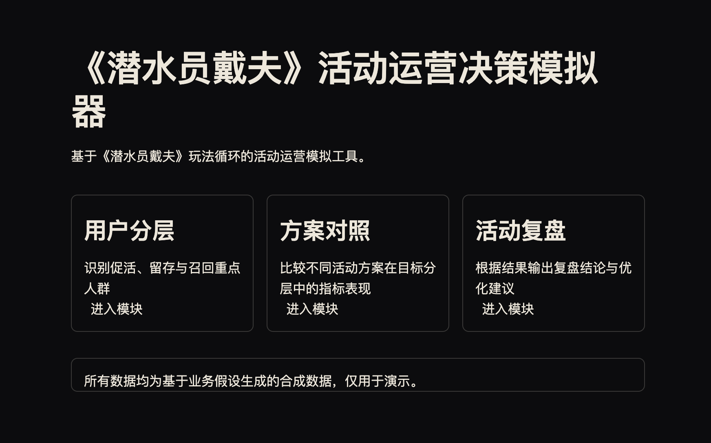
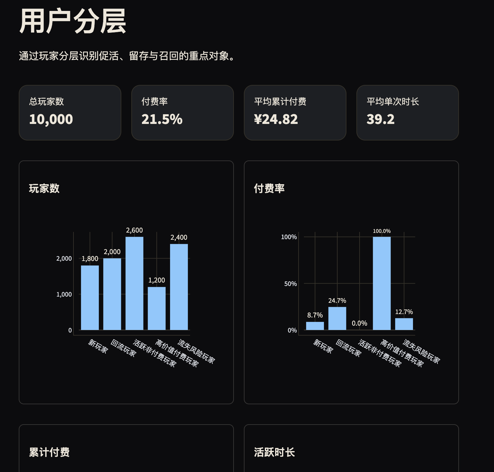
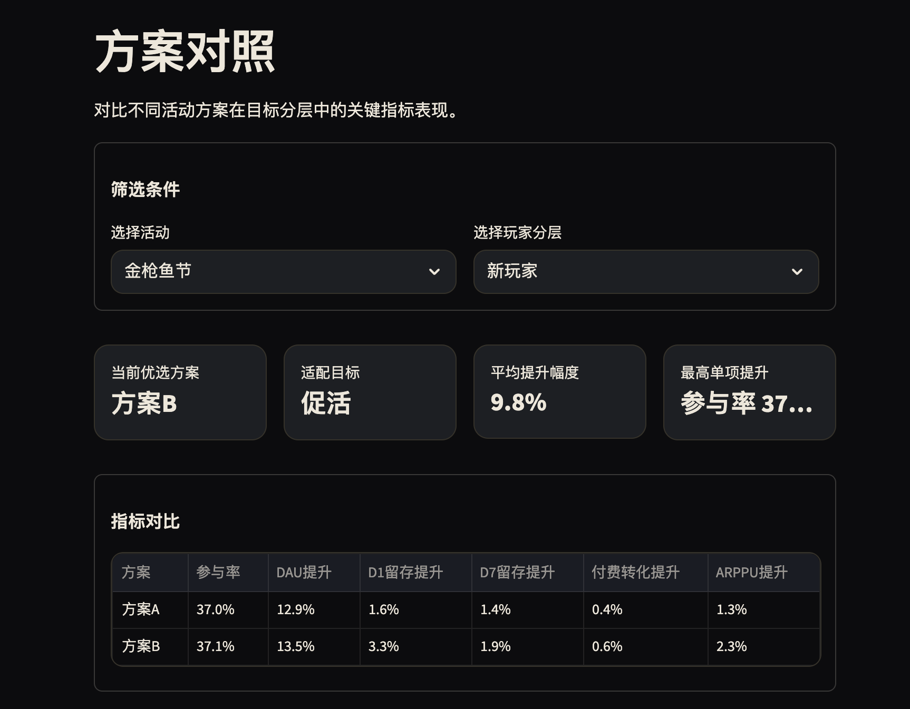
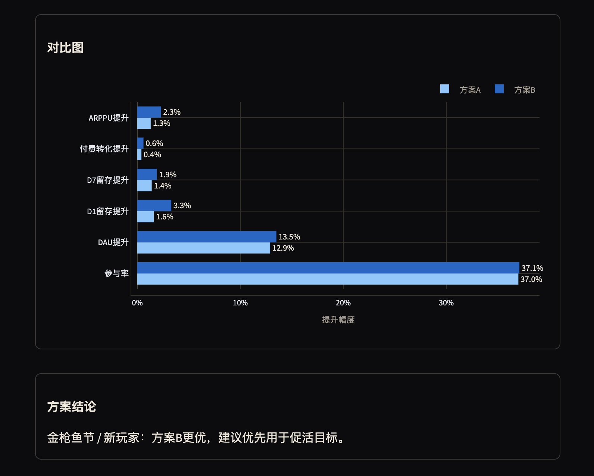
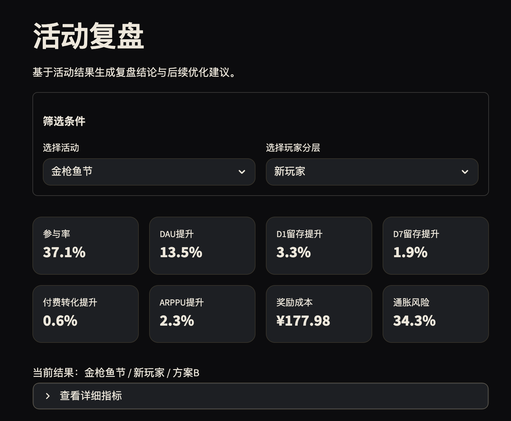
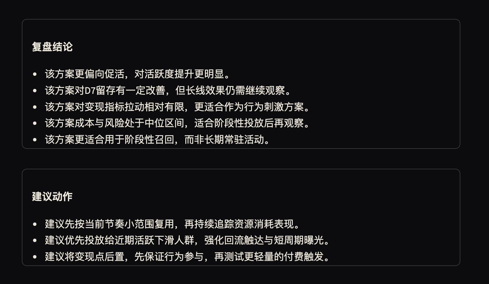

# 《潜水员戴夫》活动运营决策模拟器

## 项目简介
这个项目基于《潜水员戴夫》的题材，假设它被改造成了一款带活动运营体系的移动产品，并在这个前提下搭了一个简化的运营分析场景。

重点不在还原原作玩法，而是把活动运营里常见的几个分析动作放到同一个页面体系里：玩家分层、活动配置、方案对照和活动复盘。项目里使用的都是基于业务假设生成的合成数据，主要用来把这些分析思路做成一个能运行、能展示的原型。

## 核心功能
- 用户分层：查看不同分层的人数、付费表现、活跃时长和流失风险。
- 活动配置：选择活动类型、目标圈层、奖励强度、活动时长和核心目标指标。
- 方案对照：对比不同活动方案在目标分层中的关键指标表现。
- 活动复盘：根据结果输出复盘结论和后续建议。

## 数据说明
项目中的所有数据均为合成数据，由脚本根据业务假设生成，不包含任何真实用户数据，也不对应任何真实线上产品。

当前主要使用以下数据文件：
- `data/players.csv`
- `data/event_templates.csv`
- `data/ab_test_results.csv`

## 技术栈
- Python
- Streamlit
- Pandas
- NumPy
- Plotly

## 页面结构
- `pages/0_首页.py`：项目首页
- `pages/1_用户分层.py`：用户分层分析
- `pages/2_活动配置.py`：活动配置与方案概览
- `pages/3_方案对照.py`：A/B 方案对照
- `pages/4_活动复盘.py`：活动复盘与建议输出

## 页面演示

### 首页概览


### 用户分层


### 方案对照（上）


### 方案对照（下）


### 活动复盘（上）


### 活动复盘（下）


## 如何运行

### 1. 安装依赖
```bash
pip install -r requirements.txt
```
### 2. 如需重新生成合成数据
```bash
python src/generate_mock_data.py
```

### 3. 启动项目
```bash
streamlit run app.py
```

启动后可通过左侧导航依次查看首页、用户分层、活动配置、方案对照和活动复盘页面。

## 项目亮点
- 把玩家分层、活动配置、方案对照和复盘建议放到同一个分析场景里，而不是拆成几张互不关联的图表页。
- 虽然数据是合成的，但字段和指标背后都对应了明确的业务假设。
- 原型可以直接运行，方便展示一套完整的活动运营分析思路。

## 适用岗位
- 游戏运营
- 用户增长 / 活动运营
- 数据产品或数据策略相关初级岗位
